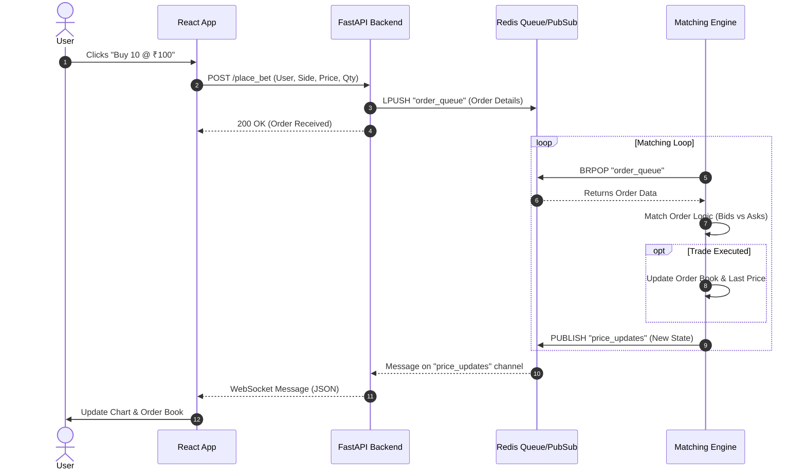
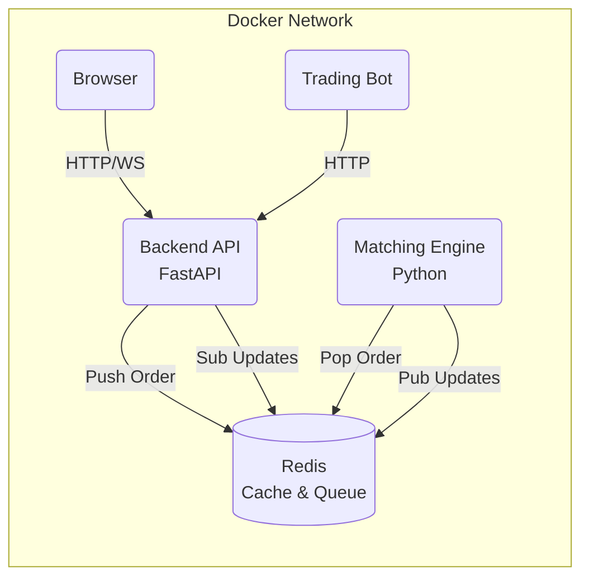

# Software Requirements Specification (SRS) & System Documentation
## Project: Pro-Trade Real-Time Betting Engine

### 1. Introduction
**Pro-Trade** is a high-performance, microservices-based trading simulation platform. It mimics a real-world stock exchange or sports betting engine where users can buy and sell shares of a hypothetical asset ("Team_India") in real-time. The system uses an order book model to match buy (bid) and sell (ask) orders.

### 2. System Architecture
The system is built as a distributed application using Docker containers. It follows an event-driven architecture decoupled by Redis.

*   **Frontend (React/Vite):** A Single Page Application (SPA) for user interaction, order placement, and real-time visualization.
*   **Backend API (FastAPI):** An HTTP/WebSocket gateway that receives user commands and streams updates.
*   **Matching Engine (Python):** A dedicated worker that processes the order queue and executes trade logic.
*   **Redis:** Serves as the message broker (Message Queue for orders, Pub/Sub for price updates) and state store.
*   **Trading Bot:** An autonomous script that generates random market activity.

### 3. Functional Requirements

#### 3.1 User Actions
*   **Place Order:** Users can submit "Buy" or "Sell" orders with a specific Price and Quantity.
*   **View Market:** Users can view the current market price, a historical price chart, and the depth of market (Order Book).
*   **Real-time Updates:** The UI must update instantly without page reloads when trades occur or the order book changes.

#### 3.2 System Logic
*   **Order Matching:** The engine must automatically match a Buy order with a Sell order if `Buy Price >= Sell Price`.
*   **Partial Fills:** If an order quantity is larger than the matching counter-order, the remainder stays in the order book.
*   **Price Priority:** Better prices (higher bids, lower asks) are matched first.
*   **Time Priority:** If prices are equal, the older order is matched first.

### 4. UML Diagrams

#### 4.1 Use Case Diagram
This diagram illustrates the primary actors and their interactions with the system.

```mermaid
usecaseDiagram
    actor User
    actor "Trading Bot" as Bot
    participant "Pro-Trade System" as System

    User --> (View Real-time Chart)
    User --> (View Order Book)
    User --> (Place Buy Order)
    User --> (Place Sell Order)

    Bot --> (Place Random Orders)
    (Place Random Orders) .> (Simulate Market Activity) : includes
```

#### 4.2 Sequence Diagram: Order Placement & Execution Flow
This flow details the lifecycle of a single trade command, from the user clicking "Buy" to the UI updating.



#### 4.3 Component Diagram
This diagram shows the structural relationships between the containerized services.



### 5. API Reference

| Method | Endpoint | Description | Payload Example |
| :--- | :--- | :--- | :--- |
| `POST` | `/place_bet` | Submit a new trade order. | `{"user_id": "Akash", "side": "BUY", "price": 100, "qty": 5}` |
| `WS` | `/ws/updates` | WebSocket for real-time market data. | *Server pushes JSON with `type: "ORDER_BOOK"`* |

### 6. Setup & Deployment
Run the entire stack using Docker Compose:
```bash
docker-compose up --build
```
Access the frontend at `http://localhost:5173`.
